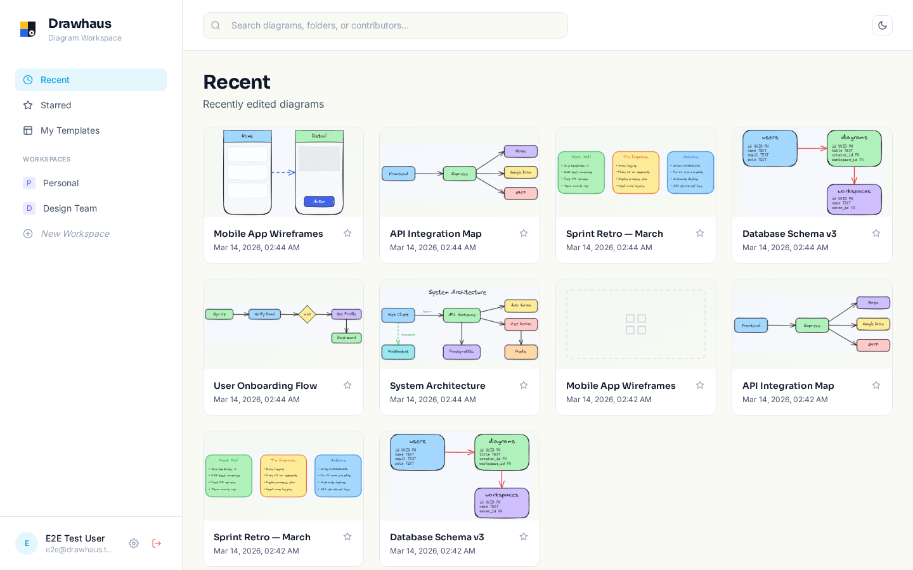

# Drawhaus

**Repo:** https://github.com/rodacato/drawhaus
**Stack:** TypeScript
**Status:** activo
**Category:** producto
**Tags:** excalidraw, collaboration, self-hosted, docker, diagramming

**URL:** https://drawhaus.notdefined.dev

## Tagline

Dibuja diagramas en equipo sin depender de servicios externos

## Description

Alternativa self-hosted a Excalidraw con colaboracion en tiempo real, multi-escenas, comentarios y templates. TypeScript, React y Express con PostgreSQL. Lo hice porque queria diagramar sin que mis datos vivieran en servidores de terceros.

## Screenshots

## Architecture decisions
<!-- Add manually: DDD patterns, tradeoffs, why this approach -->

## What I learned
<!-- Add manually: gotchas, surprises, things worth sharing -->
