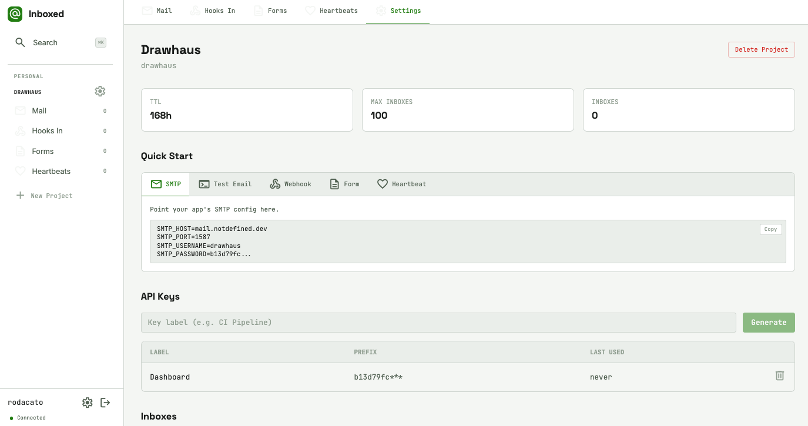

# Inboxed

**Repo:** https://github.com/rodacato/inboxed
**Stack:** Rails 8, PostgreSQL 16, Svelte 5, Tailwind CSS 4, ActionCable, Solid Queue, dry-rb, Kamal, Docker
**Status:** archived
**Category:** product
**Tags:** smtp, testing, mcp, developer-tools, self-hosted
**Version:** 0.3.0
**URL:** https://inboxed.notdefined.dev

## Tagline

Catch emails, webhooks, and HTTP requests before they hit production

## Description

Self-hosted dev inbox with SMTP capture, webhook/HTTP catchers, and an MCP server so AI agents can read your test emails too. Built with Rails 8 and Svelte 5 because I got tired of MailHog dying and RequestBin disappearing.

## Screenshots

## Architecture decisions
<!-- Add manually: DDD patterns, tradeoffs, why this approach -->

## What I learned
<!-- Add manually: gotchas, surprises, things worth sharing -->
