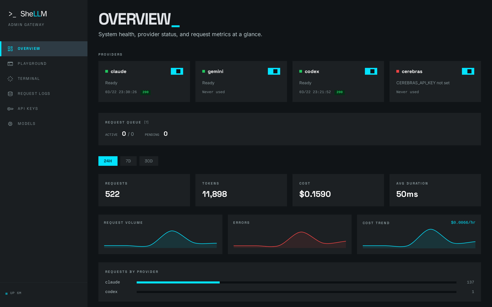
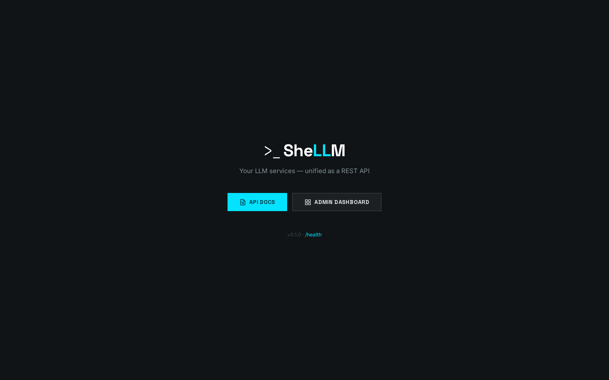
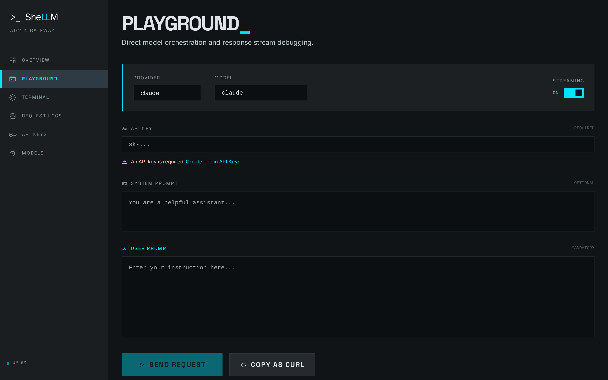
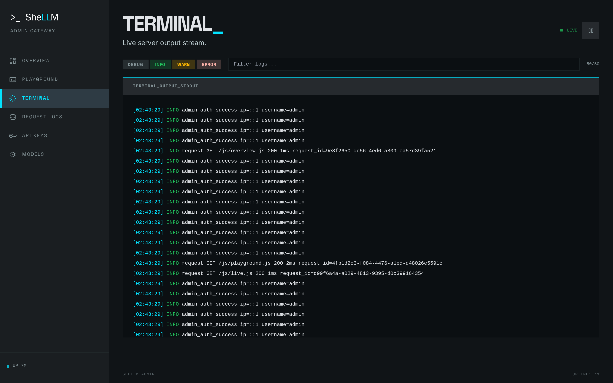
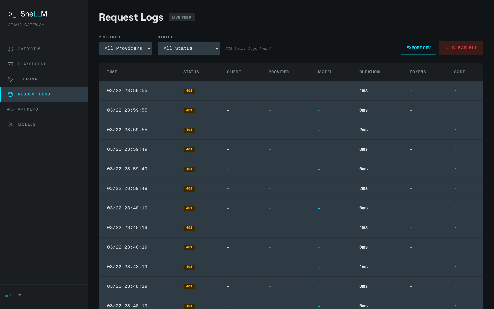
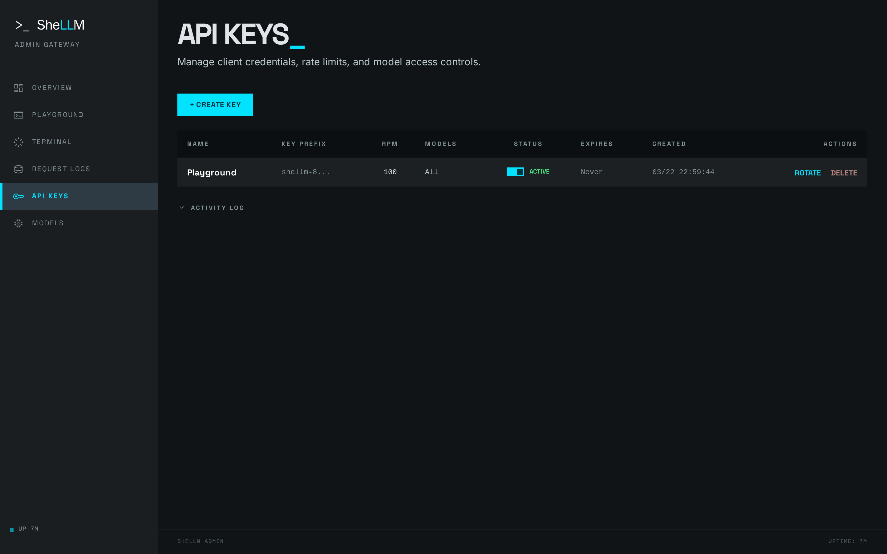
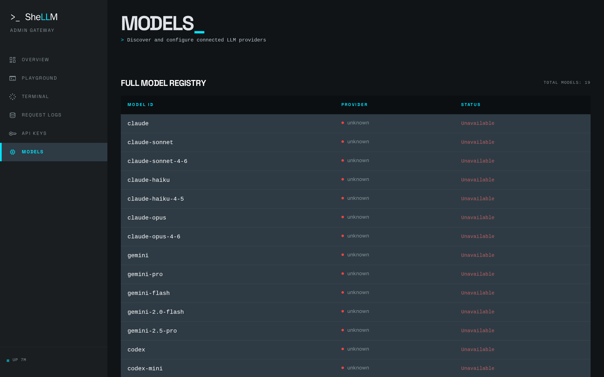

# SheLLM

**Repo:** https://github.com/rodacato/SheLLM
**Stack:** Node.js 22, Express 5, SQLite, Playwright
**Status:** active
**Category:** utility
**Tags:** ai, llm, api, self-hosted
**Version:** 0.5.0

## Tagline

Your LLM subscriptions as a single REST API

## Description

Unifies Claude, Gemini, Codex and Cerebras under an OpenAI-compatible endpoint — wrapping CLI subscriptions you already pay for instead of burning API tokens. Self-hosted, Express + SQLite, with an admin dashboard.

## Screenshots

## Architecture decisions
<!-- Add manually: DDD patterns, tradeoffs, why this approach -->

## What I learned
<!-- Add manually: gotchas, surprises, things worth sharing -->
