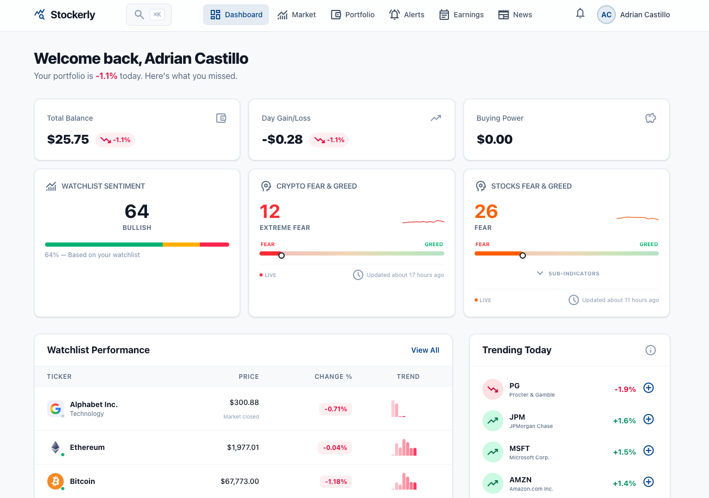

# Stockerly

**Repo:** https://github.com/rodacato/stockerly
**Stack:** Ruby
**Status:** activo
**Category:** producto
**Tags:** fintech, rails, ddd, hotwire, portfolio

## Tagline

Tu terminal de mercados, portafolio y alertas — sin pagar Bloomberg

## Description

Plataforma fintech open source para seguir tendencias del mercado, administrar portafolios, configurar alertas y revisar earnings. Hecho con Rails 8, PostgreSQL, Hotwire y Tailwind CSS 4. Arquitectura DDD + Hexagonal con 6 bounded contexts y eventos de dominio.

## Screenshots

## Architecture decisions
<!-- Add manually: DDD patterns, tradeoffs, why this approach -->

## What I learned
<!-- Add manually: gotchas, surprises, things worth sharing -->
