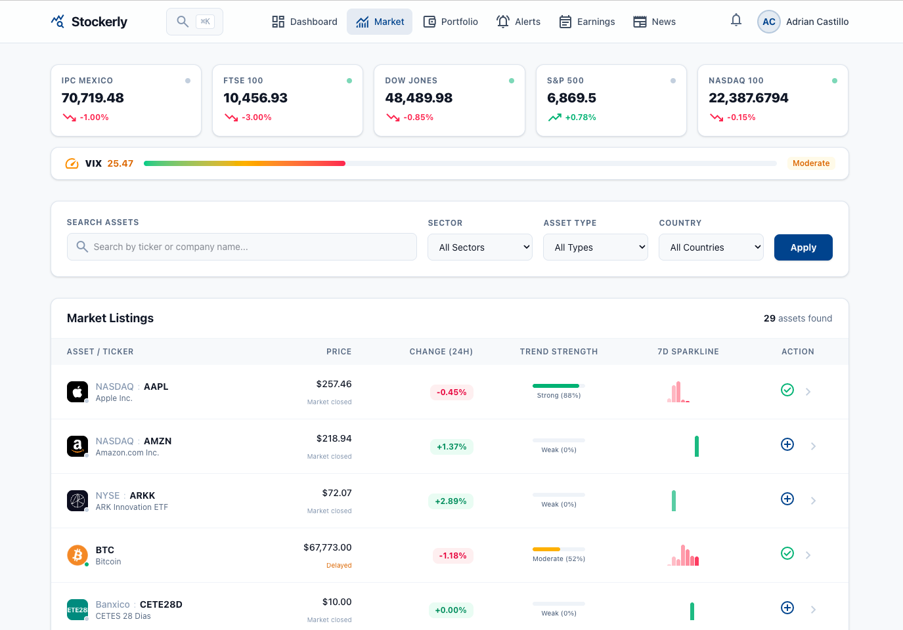
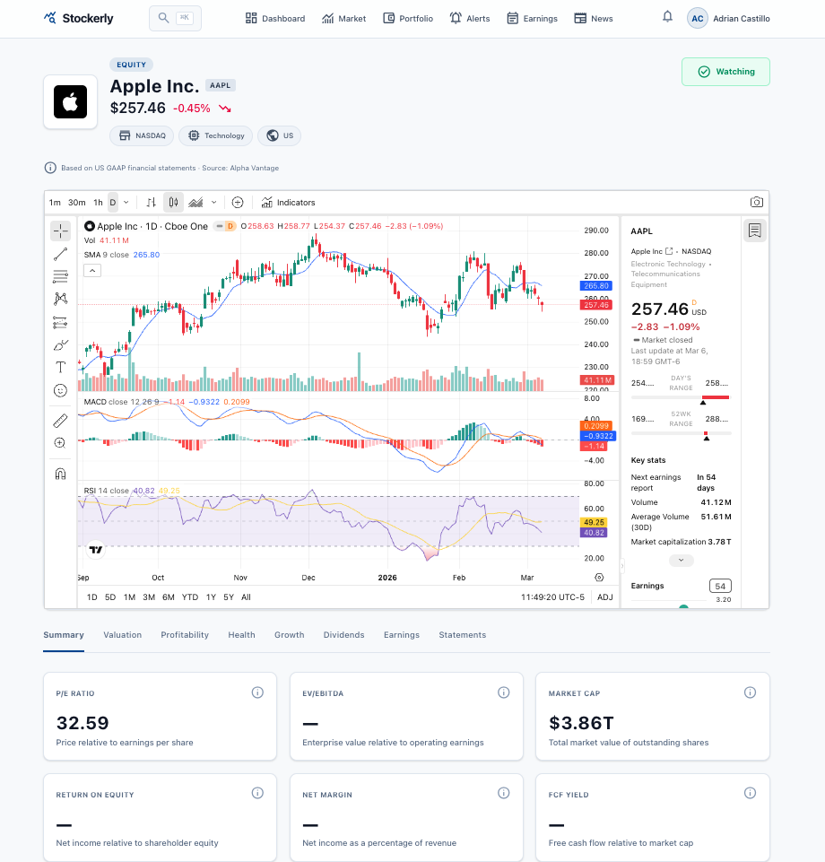
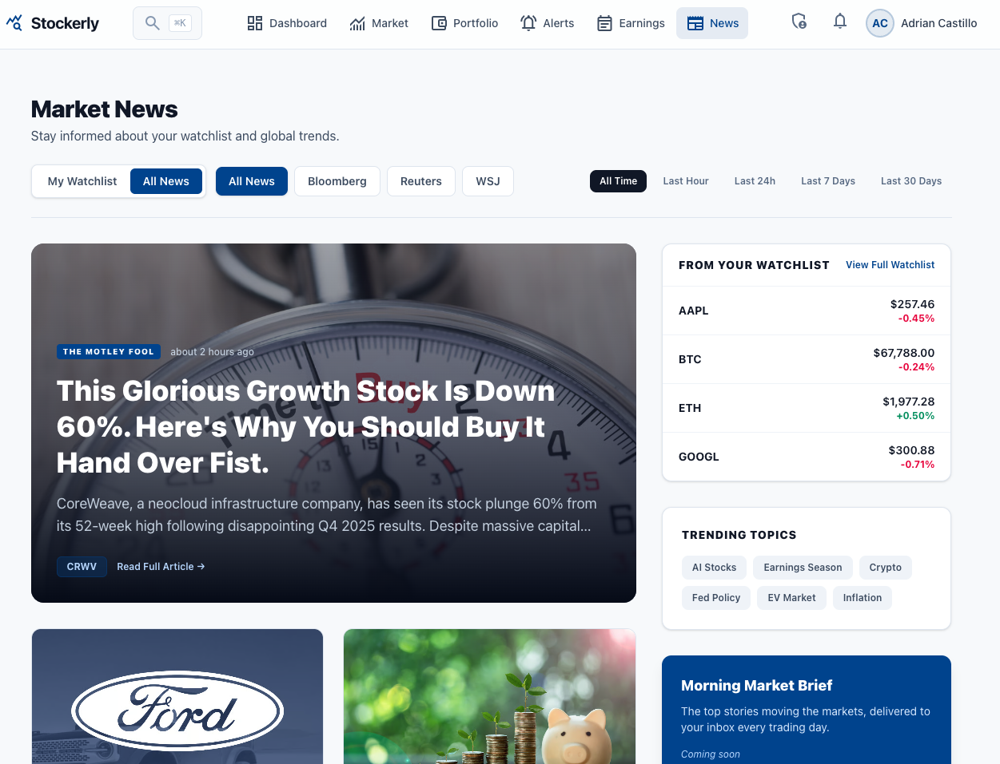

# Stockerly

**Repo:** https://github.com/rodacato/stockerly
**Stack:** Rails 8, PostgreSQL 16, Hotwire, Tailwind CSS 4, dry-rb, Solid Queue, Kamal 2
**Status:** active
**Category:** product
**Tags:** fintech, rails, ddd, docker
**Version:** 0.1.0-rc1
**URL:** https://stockerly.notdefined.dev

## Tagline

Track your investment portfolio without depending on anyone

## Description

Stock tracking, price alerts, earnings calendar, and market trends. Open-source, self-hosted, built with Rails 8 and Hotwire. I built it because free finance apps always end up hitting you with a paywall.

## Screenshots

## Architecture decisions
<!-- Add manually: DDD patterns, tradeoffs, why this approach -->

## What I learned
<!-- Add manually: gotchas, surprises, things worth sharing -->
